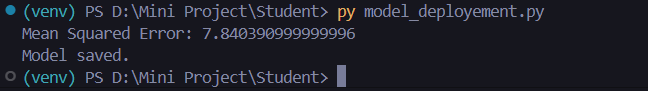
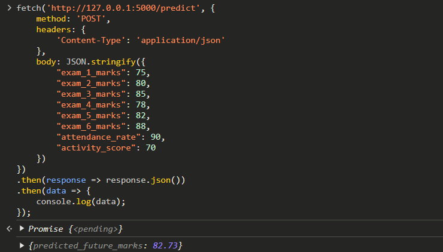

# **Student Future Performance Prediction System**

This project utilizes machine learning to predict student performance based on historical exam data and additional features such as attendance rate, activity scores, and more. The model, powered by **Random Forest Regressor**, is exposed via a **Flask API**, allowing for easy integration into other applications.

---

## **Project Features**

- **Model**: Random Forest Regressor
            -Random Forest is a robust machine learning algorithm that creates multiple decision trees and merges them to get a more accurate and stable prediction. 
            -This method is particularly effective for handling high-dimensional datasets and capturing complex patterns in the data
- **Key Features**:
  - Marks from 6-10 previous exams or semesters.
  - Attendance rate (percentage of classes attended).
  - Activity score (participation in extracurricular activities).
  - Predicted future marks based on trends and historical data.

---


### **Steps**

Prequeiste: **Python 3.7+** installed.

1. **Clone the Repository**:
    ```bash
    git clone https://github.com/yourusername/student-performance-predictor.git
    cd student-performance-predictor
    ```

2. **Create a Virtual Environment** *(Optional but Recommended)*:
    ```bash
    python -m venv venv
    ```

3. **Activate Virtual Environment**:

      ```bash
      .\venv\Scripts\activate
      ```

4. **Install Dependencies**:
    ```bash
    pip install -r requirements.txt
    ```

---

### **Running the API**

1. **Start the Flask Application**:
    ```bash
    python model_api.py
    ```

    The Flask app will be available at `http://127.0.0.1:5000`.

---
## **Steps to Use the Prediction API with JavaScript**

### **1. Open Developer Tools in Your Browser**
- Right-click on the webpage and select **Inspect** or **Inspect Element**.
- This will open the browser's **Developer Tools** window.

### **2. Go to the Console Tab**
- In the Developer Tools window, click on the **Console** tab to open the JavaScript console.

### **3. Use the JSON Code**
- Copy and paste the following JavaScript code into the console. This code sends a `POST` request to the Flask API and retrieves the predicted marks for a student based on their exam data, attendance rate, and activity score.

```javascript
fetch('http://127.0.0.1:5000/predict', {
    method: 'POST',
    headers: {
        'Content-Type': 'application/json'
    },
    body: JSON.stringify({
        "exam_1_marks": 75,
        "exam_2_marks": 80,
        "exam_3_marks": 85,
        "exam_4_marks": 78,
        "exam_5_marks": 82,
        "exam_6_marks": 88,
        "attendance_rate": 90,
        "activity_score": 70
    })
})
.then(response => response.json())
.then(data => {
    console.log(data);
});
```
### **4.View the Prediction Output**
- Once you press Enter, the result will be shown directly in the console.
- The output will look like this:
```javascript
{
    "predicted_marks": 82.91
}
```
---
## **My Ouputs:**
### **Mean Square Error During Deployment phase**

### **Final Example Output**


---
